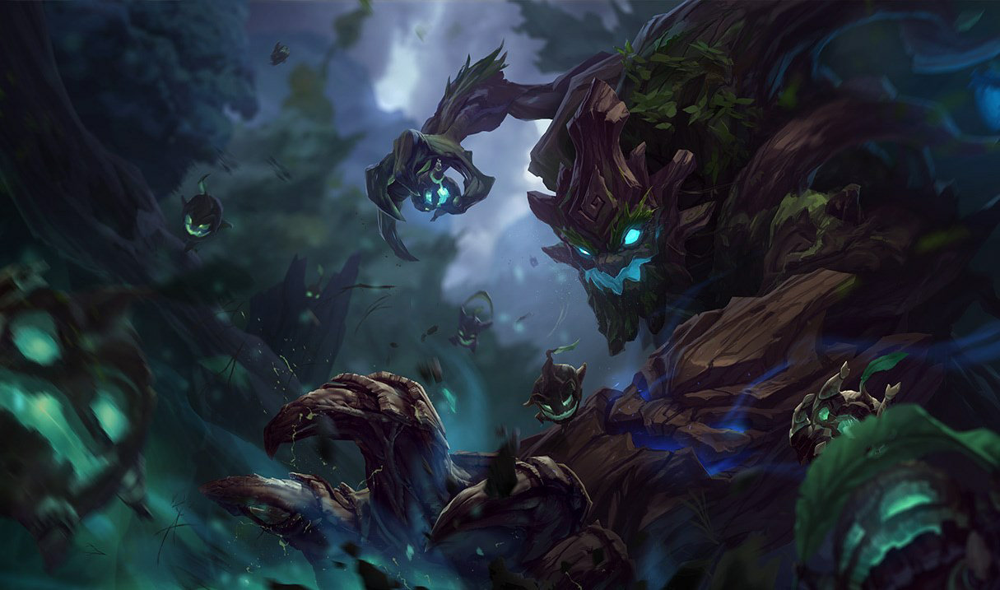

# Projeto Individual - A Floresta em League Of Legends
## Preservação das Florestas e League of Legends
#### Por: Marcio R. Julião

## O Projeto, temáticas abordadas

As florestas, frequentemente chamadas de "pulmão da terra", são essenciais para a sobrevivência da humanidade e do planeta. Elas purificam o ar, regulam o clima, impedem a evaporação excessiva da água e sustentam a biodiversidade. Entretanto, o desmatamento acelerado ameaça essas funções vitais. Entre 2000 e 2020, o Brasil perdeu 13% de sua cobertura florestal, uma área equivalente ao tamanho do Reino Unido. Se essa tendência continuar, a Floresta Amazônica pode se transformar em um deserto em 40 anos, resultando em uma perda massiva de biodiversidade.

A Organização das Nações Unidas (ONU) reconheceu a gravidade dessa situação e, em 2015, estabeleceu os 17 Objetivos de Desenvolvimento Sustentável (ODS) como parte da Agenda 2030. O ODS 15 foca na conservação, recuperação e uso sustentável dos ecossistemas terrestres, especialmente florestas.

O papel das obras de arte, histórias e jogos de videogame é crucial na sensibilização e mobilização das pessoas em prol da preservação ambiental. A Riot Games, com seu popular jogo League of Legends (LoL), aborda essas questões através de personagens como Maokai e Ivern, que simbolizam a ligação profunda com a natureza.

### Maokai, O Ente Sinistro

Maokai, um espírito da natureza, dá vida às Ilhas das Sombras, criando florestas exuberantes. Quando um rei enlouquecido corrompe a nascente mágica com um ritual proibido, Maokai se transforma em um monstro vingativo, lutando para restaurar a beleza perdida das ilhas. Sua história simboliza a batalha pela recuperação dos ecossistemas devastados.

### Ivern, O Pai do Verde

Ivern, um guerreiro transformado em homem-árvore, busca redenção após destruir um bosque sagrado. Ele aprende a proteger e cultivar a natureza, utilizando sua sabedoria para promover a harmonia entre os seres vivos. Sua jornada representa a transformação e o compromisso com a preservação ambiental.

## Agradecimentos

Dedico este projeto aos meus familiares e amigos, por sempre demonstrarem seu apoio verdadeiramente incondicional. Agradeço também, a todos os professores que me ajudaram no projeto, seja tirando dúvidas ou contribuindo com sugestões.